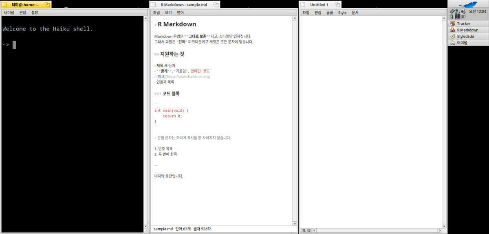

# R Tiler for Haiku OS

[English](README.md)

열려 있는 창들을 화면에 배치해 주는 Deskbar 트레이 항목입니다. 누르면 창이 정렬됩니다.



가로로 넓고 세로가 짧은 화면 — Sony VAIO P는 1600×768입니다 — 을 기준으로 만들었습니다. 그래서 세로를 꽉 채운 열을 우선하고, 가로로 다 들어가지 않을 때만 두 번째 줄을 만듭니다.

## 요구 사항

Haiku OS (x86 또는 x86_64). 크로스 컴파일러가 필요 없으니 실행할 기기에서 그대로 빌드하시면 됩니다.

## 설치

```sh
./install.sh
```

컴파일한 뒤 바이너리를 `~/config/non-packaged/apps/`에 넣고, **Deskbar → Applications** 메뉴에 등록하고 트레이 항목을 설치합니다.

```sh
./install.sh --build-only   # 빌드만 하고 설치하지 않음
./install.sh --uninstall    # 트레이 항목과 바이너리 제거
```

## 사용법

- 트레이 아이콘을 **클릭**하면 자동 배치됩니다.
- **우클릭**하면 배치 방식을 고를 수 있습니다: 2단, 3단, 격자, 모두 최대화, 그리고 **되돌리기** — 배치 직전 위치로 모든 창을 되돌립니다.
- 셸이나 단축키에서도 부를 수 있습니다.

```sh
"R Tiler" --tile          # 자동
"R Tiler" --tile 2        # 2단
"R Tiler" --tile 3        # 3단
"R Tiler" --tile grid     # 2 x 2
"R Tiler" --tile max      # 모두 최대화
"R Tiler" --remove        # Deskbar에서 제거
```

일반 응용프로그램 창만 옮깁니다. 패널, 메뉴, 데스크톱, 그리고 테두리 없는 창 — 예를 들어 R Memo의 메모 — 은 그대로 둡니다. 그래서 여러 종류의 창이 섞인 화면에서 눌러도 안전합니다. 최소화·숨김 상태이거나 다른 워크스페이스에 있는 창도 건너뜁니다.

메뉴는 시스템 언어에 따라 한국어·영어·일본어·독일어·프랑스어로 표시됩니다.

## 라이선스

MIT

## AI 활용 고지

이 프로그램은 Claude와 함께 작업해 만들었습니다.
