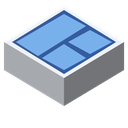
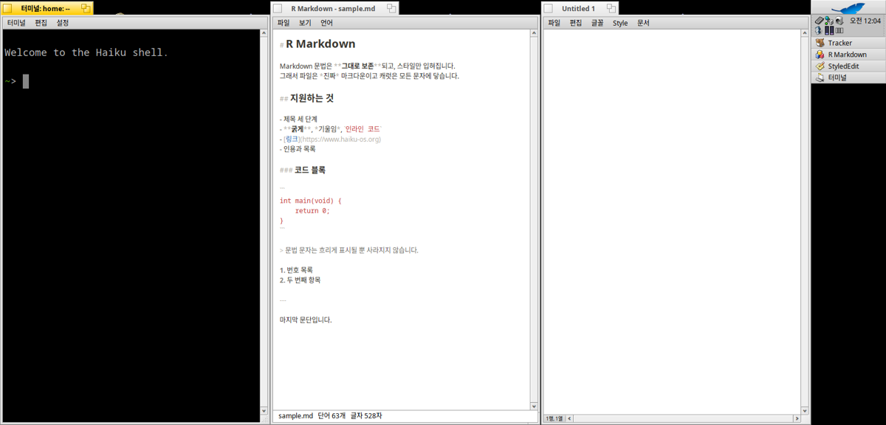

# R Tiler for Haiku OS

[한국어](README.ko.md)

A Deskbar tray item that lays the open windows out on screen. Click it; the windows tile.



Built for a short, wide panel — a Sony VAIO P is 1600×768 — so the layouts prefer full-height columns and only start a second row once there are more windows than fit across.

## Requirements

Haiku OS (x86 or x86_64). Build it on the machine you are going to run it on — no cross-compiler needed.

Also builds and runs on arm64, cross-compiled against the Haiku kits; it needs nothing outside them.

## Install with pkgman

| Haiku | Commands |
| --- | --- |
| 32-bit x86 (x86_gcc2) | `pkgman add-repo https://pkgman.rainygirl.com/x86_gcc2`<br>`pkgman install rtiler` |
| arm64 | `pkgman add-repo http://pkgman.rainygirl.com/arm64`<br>`pkgman install rtiler` |

Then start **R Tiler** once from Deskbar -> Applications to put the icon into the tray.

If `pkgman add-repo` fails with `Operation not supported`, the network kit of that image has no TLS; use `http://` instead of `https://` in the address.

## Install from source

```sh
./install.sh
```

This compiles it, puts the binary in `~/config/non-packaged/apps/`, adds it to **Deskbar → Applications**, and installs the tray item.

```sh
./install.sh --build-only   # compile in place, install nothing
./install.sh --uninstall    # remove the tray item and the binary
```

## Using it

- **Click** the tray icon to tile automatically.
- **Right-click** for the layouts: two columns, three columns, grid, maximize all, and **Undo**, which puts every window back where it was before the last tiling.
- It can also be driven from a shell or a keyboard shortcut:

```sh
"R Tiler" --tile          # automatic
"R Tiler" --tile 2        # two columns
"R Tiler" --tile 3        # three columns
"R Tiler" --tile grid     # 2 x 2
"R Tiler" --tile max      # maximize all
"R Tiler" --remove        # take the item out of the Deskbar
```

Only ordinary application windows are moved. Panels, menus, the Desktop and anything borderless — R Memo's notes, for instance — keep their place, so clicking this with a full screen of mixed windows is safe. Minimized and hidden windows, and windows on other workspaces, are skipped.

Menus are available in English, Korean, Japanese, German and French, following the system language.

## License

MIT

## AI disclosure

This program was written with Claude.
